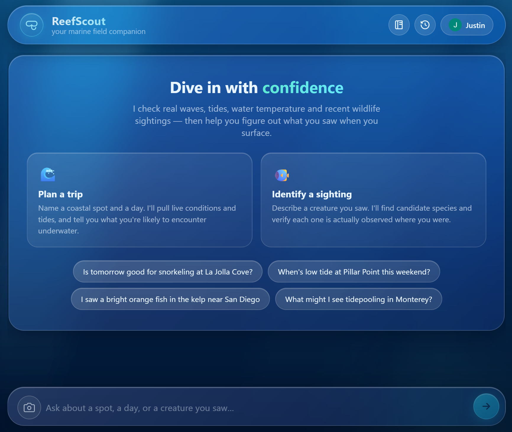
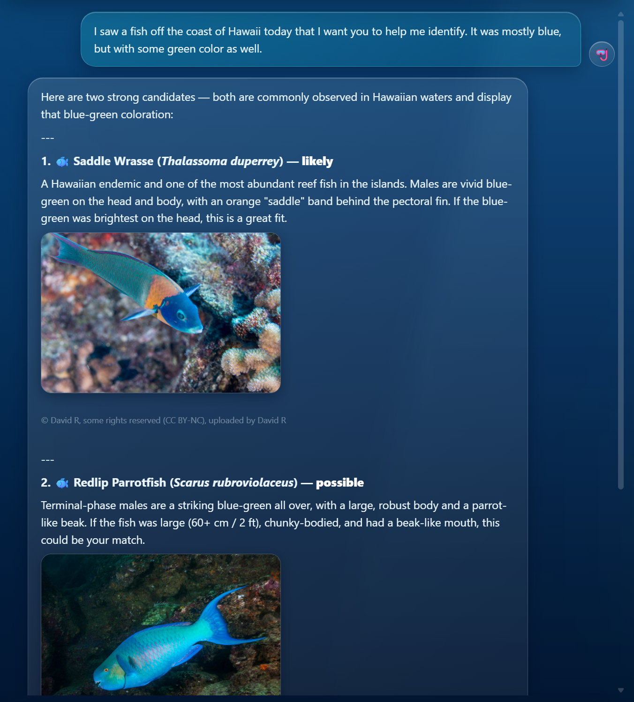

# 🐠 ReefScout — your marine field companion

**Ask whether a coastal spot is good for snorkeling or tidepooling and what you'll likely see —
or describe (or photograph) a creature you saw and let ReefScout identify it and check whether
that species can actually be there.** Then keep a personal logbook of everything you've spotted.

ReefScout is an **agentic** application: a Claude model decides which tools to call, chains them
based on the results, and verifies its own answers against authoritative marine data. The tools
are exposed through a **custom MCP server** and backed by **free, no-API-key** live ocean data.

### ▶️ Live app: **https://reefscout.onrender.com**
Free tier — if it's been idle it may take ~30–60 s to wake on the first request.

<p align="center"></p>

---

## What it does

- **Plan a trip.** *"Is Saturday morning good for snorkeling at La Jolla Cove, and what might I
  see?"* → live waves/swell/water-temp, tide timing, and the species you're realistically likely
  to encounter, with a clear **go / caution / skip** verdict.
- **Identify a sighting.** *"I saw a small bright-orange fish with white stripes on the reef"* —
  by text or **photo** — → candidate species, **verified against where they actually occur**, with
  a reference photo and conservation status.
- **Keep a logbook.** Sign in with Google to save your conversations and build a **life-list** of
  sightings (auto-enriched with scientific name, taxon group, conservation status, and a photo)
  plus a trip log. One tap from any identification adds it to your logbook.

---

## 📸 Built for images — because words can't describe a fish

Identifying marine life from text alone is genuinely hard: *"small, mostly blue with some green"*
fits hundreds of species. So ReefScout is **multimodal in both directions** — which is unusual for
a chat app, and the heart of why it works for ID:

- **You send a photo.** Snap the creature and attach it; the vision model identifies from the
  *actual image* — color, pattern, fin shape, habitat in frame — not a vague description. (Photos
  are downscaled in the browser before upload to keep it fast and cheap.)
- **ReefScout sends photos back.** For every candidate species it proposes, it fetches a real
  reference photo (iNaturalist, with photographer attribution) so you can **eyeball the match** —
  *"does it look like this?"* — instead of trusting a name you can't picture.

<p align="center"></p>

*Above: a text description of a blue-green fish seen off Hawaii. ReefScout proposes the **Saddle
Wrasse** *(Thalassoma duperrey)* — likely — and the **Redlip Parrotfish** *(Scarus rubroviolaceus)*
— possible, each with a reference photo to compare against. That photo-in / photos-out loop is
exactly how a field guide is used, and it's why ReefScout beats a text-only bot at this task.*

---

## Architecture

```
Browser (single-file Liquid-Glass UI)
  │  ├─ POST /chat ───────────────► FastAPI ──► Claude (Anthropic API)
  │  │                                 │  agent loop: read tool_use →
  │  │                                 │  dispatch over MCP → feed result back → repeat
  │  │                                 ▼
  │  │                          MCP server (FastMCP, stdio)  ── our 7 tools
  │  │                                 │
  │  │                                 ▼
  │  │                  Live data (free, no key): Open-Meteo · NOAA CO-OPS ·
  │  │                                 iNaturalist · WoRMS
  │  ├─ GET /species/resolve ──────► FastAPI (WoRMS) → enrich a logbook sighting
  │  ├─ GET /firebase-config.js ──► FastAPI (env vars) → public Firebase config
  │  └─ Firebase Auth + Firestore ◄── directly from the browser (history + logbook)
```

The agent backend and the persistence layer are deliberately **decoupled**: the browser talks to
Firestore directly (gated by security rules), so the FastAPI/agent service never holds Firebase
credentials and the agent never depends on the database.

### Components

| File | Role |
|---|---|
| [`app/ocean_data.py`](app/ocean_data.py) | Live data layer — async functions over Open-Meteo, NOAA, iNaturalist, WoRMS, each normalized to a clean dict. No LLM logic. |
| [`app/mcp_server.py`](app/mcp_server.py) | **Our** FastMCP server exposing 7 tools (name + description + input schema each). The tools/data ↔ agent boundary. |
| [`app/agent.py`](app/agent.py) | The agentic core: an MCP client + a manual Claude tool-call loop that returns the answer **plus a tool-call trace**. |
| [`app/prompts.py`](app/prompts.py) | Versioned system prompts (v1 → v2 → v3). |
| [`app/main.py`](app/main.py) | FastAPI: serves the UI, `/chat`, `/species/resolve`, `/firebase-config.js`, `/health`. |
| [`static/index.html`](static/index.html) | The entire frontend — chat, logbook, auth — in one file, no build step. |

### MCP tools (all backed by free, no-key APIs)

| Tool | Source | Does |
|---|---|---|
| `geocode_place` | Open-Meteo | place name → coordinates |
| `get_marine_conditions` | Open-Meteo Marine | wave height, swell, sea-surface temp for a date |
| `get_tides` | NOAA CO-OPS | high/low tides at the nearest station |
| `get_species_nearby` | iNaturalist | real recent sightings near a coordinate |
| `get_species_images` | iNaturalist | reference photos (with attribution) |
| `search_marine_taxa` | WoRMS | name/description → candidate species |
| `get_species_detail` | WoRMS | taxonomy, distribution, conservation status |

### Why it's genuinely agentic

The model — not our Python — chooses **which** tools to call, **in what order**, and **when to
stop**. Remove the LLM and replace it with a lookup table and the behavior collapses: the branching,
the decision to verify an ID against location, and the synthesis all live in the model's responses.
Our code only provides the tools and the loop.

### Persistence — history & logbook (signed-in)

This layer is **client-side and fully decoupled** from the agent: the browser talks to Firebase
directly, so the FastAPI/agent service holds no Firebase credentials.

- **Auth + data:** Firebase Auth (Google sign-in) + Cloud Firestore. Each user reads/writes only
  their own `users/{uid}/conversations`, `/sightings`, and `/trips`, enforced by
  [`firestore.rules`](firestore.rules). Signed-out use works but is ephemeral.
- **Config injection:** the public Firebase web config is served at runtime by
  `GET /firebase-config.js` from `FIREBASE_*` env vars — never committed to the repo.
- **Logbook enrichment:** the "log a sighting" form asks only for name/place/date/notes;
  `GET /species/resolve` then fills in the scientific name, taxon group, conservation status, and a
  reference photo from WoRMS + iNaturalist (no LLM, no key). A one-tap **"Add to logbook"** button
  on any identification pre-fills it from the chat.
- **Photos:** each sighting gets a default reference photo, or the user's own upload — downscaled
  client-side and stored as a compact image inside the sighting's Firestore doc (one per doc, under
  the 1 MB limit), so no Firebase Storage (and no billing upgrade) is required.

---

## A complete interaction (real output, lightly trimmed)

**User:** *"Is Saturday morning good for snorkeling at La Jolla Cove, and what might I see?"*

**Tool calls the model made** (shown live in the UI's trace panel):

```
geocode_place({"place": "La Jolla Cove"})    → no match
geocode_place({"place": "La Jolla"})         → 32.847, -117.274     (retried with a simpler name)
get_marine_conditions(32.847, -117.274, "2026-06-20")
get_tides(32.847, -117.274, "2026-06-20")
get_species_nearby(32.847, -117.274, iconic_taxa="Actinopterygii,Mollusca,Echinodermata,Cnidaria")
get_species_images("Hypsypops rubicundus")   ┐ reference photos for the
get_species_images("Hermissenda opalescens") │ highlight species — fetched
get_species_images("Flabellinopsis iodinea") │ unprompted
get_species_images("Octopus bimaculoides")   ┘
```

**Reply:**

> **Marginal — waves are on the high side; best window is around the morning low tide at 8:26 AM.**
>
> **Conditions — Saturday, June 20**
> | | |
> |---|---|
> | Max wave height | 1.26 m (4.1 ft) |
> | Wave period | 13.5 s (long-period swell — sets feel bigger) |
> | Water temp | ~20.6 °C (69 °F) — wetsuit recommended |
>
> **Tides (La Jolla Scripps station, 2.7 km away)** — the **8:26 AM low is exceptionally low**
> (~0.02 ft MLLW); aim to be in the water 7:30–9:30 AM.
>
> **What you're likely to see** (719 species logged nearby): 🟠 **Garibaldi**
> *(Hypsypops rubicundus)*, 🔵 **Opalescent Nudibranch**, 🟣 **Spanish Shawl**, 🐙 **Lesser
> Two-spot Octopus** — each with a reference photo + attribution.
>
> ⚠️ The 1.26 m / 13.5 s swell is on the rough side. Check the lifeguard station, watch a few
> sets before entering, and recheck the forecast Friday evening.

Note the agentic moves: it **recovered from a failed geocode** on its own, **chained** four data
tools, and **fetched a photo per highlight species** without being told to.

### A second interaction — identification with verification

**User:** *"I think I saw a clownfish like Nemo while snorkeling at La Jolla yesterday. Cool right?"*

**Tool calls:**

```
geocode_place({"place": "La Jolla"})
search_marine_taxa({"query": "clownfish"})                      ← reason to a candidate, look it up
get_species_nearby(32.847, -117.274, iconic_taxa="Actinopterygii")  ← does it occur HERE?
get_species_detail({"aphia_id": 212783})                        ← range / environment check
get_species_images("Hypsypops rubicundus")                      ← photo of the real candidate
```

**Reply (trimmed):**

> **Unlikely — no clownfish live in La Jolla waters.** Clownfish (*Amphiprion*) are tropical
> Indo-Pacific reef fish; La Jolla is a temperate California kelp forest, and there are **zero
> iNaturalist observations** of clownfish near it.
>
> The much more likely culprit: the **Garibaldi** *(Hypsypops rubicundus)* — La Jolla's #2
> most-observed fish, a big brilliant-orange kelp-forest fish. *(+ photo & attribution)* Does that
> match what you saw — solid orange, no white stripes?

This is the distinctive behavior: the model **didn't just accept the ID** — it checked the claim
against where the species actually occurs, **refuted it with evidence**, and proposed a
location-appropriate alternative. Across the two examples, all 7 MCP tools are exercised.

---

## Evaluation

[`eval/run_eval.py`](eval/run_eval.py) defines "good" as three executable dimensions — **agentic
correctness** (the model calls the right tools per question type, asserted on the trace, including
a negative case), **grounded answers** (dates resolve, verdict-first, dual units), and **honesty at
the edges** (an out-of-range ID is challenged; off-topic is declined with zero tool calls).

**9 structured cases, 9/9 passing.** An earlier run scored 7/8 — the documented failure drove
system-prompt v2. Results and run history: [`eval/RESULTS.md`](eval/RESULTS.md). Run it with
`python -m eval.run_eval`.

There are also fast integration tests: `pytest` (14 tests over the data layer, MCP server, and API).

---

## Run it locally

```bash
git clone https://github.com/justinswork/ReefScout && cd ReefScout
python -m venv venv && . venv/Scripts/activate     # Windows; use venv/bin/activate on macOS/Linux
pip install -r requirements.txt
cp .env.example .env                               # then add your ANTHROPIC_API_KEY
uvicorn app.main:app --reload --port 8000          # open http://localhost:8000
```

Only `ANTHROPIC_API_KEY` is required to chat (all ocean data is keyless). Add the `FIREBASE_*`
vars to enable Google sign-in, history, and the logbook — see
[`docs/FIREBASE_SETUP.md`](docs/FIREBASE_SETUP.md).

**Deploy:** [`docs/DEPLOY.md`](docs/DEPLOY.md) (Render blueprint in [`render.yaml`](render.yaml)).

---

## Project structure

```
app/
  main.py          FastAPI: UI, /chat, /species/resolve, /firebase-config.js, /health
  agent.py         MCP client + Claude tool-call loop (the agentic core)
  mcp_server.py    FastMCP server — our 7 ocean-data tools
  ocean_data.py    live data layer (Open-Meteo, NOAA, iNaturalist, WoRMS)
  prompts.py       versioned system prompts (v1 → v2 → v3)
static/index.html  single-file Liquid-Glass UI (chat, logbook, auth)
tests/             pytest: data layer, MCP server, API
eval/              run_eval.py + RESULTS.md
prompts/           PROMPT_LOG.md (prompt iteration log)
docs/              DEPLOY.md, FIREBASE_SETUP.md
firestore.rules    per-user security rules
render.yaml        Render deploy blueprint
overview.md · rubric.md · plan.md · BUILD_LOG.md
```

---

## What ReefScout does *not* do

- It is **not a safety authority.** Conditions guidance is informational; it defers to lifeguards
  and local advisories, and is told to hedge when data is thin rather than fabricate.
- It does **not invent data.** Every number comes from a live tool call; thin data is flagged.
- ID coverage is best where the underlying databases are rich (well-studied coasts). Tides cover
  US coasts (NOAA); elsewhere it says so.
- User-uploaded logbook photos are stored as a single downscaled image per Firestore doc (no
  Firebase Storage); originals are not retained full-resolution.

---

## Security

ReefScout is a public, unauthenticated app whose `/chat` endpoint spends a real API key, so the
main risk is **resource abuse, not data theft**. Mitigations in place: per-IP + global **rate
limiting** on `/chat` and `/species/resolve`, bounded request sizes, generic (non-leaking) error
messages, per-user Firestore rules with a deny-all default, HTML-escaped output, and no
server-side fetching of user-supplied URLs. The hard cost ceiling is a **monthly spend limit set
on the API key**. Full audit, findings, and the operational checklist: [docs/SECURITY.md](docs/SECURITY.md).

## Rubric checklist

Status of each project requirement (2 pts each). ✅ met · ◐ in progress.

| # | Requirement | Status | Where / how |
|---|---|---|---|
| 1 | Deployment | ✅ | Live at **https://reefscout.onrender.com** (free tier; wakes on load). Verified end-to-end. |
| 2 | Prompt engineering | ✅ | System prompt **v1 → v2 → v3** with documented rationale — [prompts/PROMPT_LOG.md](prompts/PROMPT_LOG.md). |
| 3 | System prompt(s) | ✅ | Purposeful role/scope/format prompt — [app/prompts.py](app/prompts.py). |
| 4 | Grounding | ✅ | Live conditions, tides, real sightings + authoritative WoRMS taxonomy injected via tools — [app/ocean_data.py](app/ocean_data.py). |
| 5 | MCP tool (definition) | ✅ | **Our own** FastMCP server, **7 tools** with name/description/schema — [app/mcp_server.py](app/mcp_server.py). Not a pre-built connector. |
| 6 | MCP tool (execution) | ✅ | Manual tool-call loop reads `tool_use`, dispatches over MCP, feeds results back — [app/agent.py](app/agent.py). Verified live. |
| 7 | Agentic behavior | ✅ | The model picks which tools to call, chains them, and decides when to stop (e.g. retries a failed geocode; skips the species tool when not asked). |
| 8 | Code on GitHub | ✅ | Public repo with an incremental, meaningful commit history. |
| 9 | Build log | ✅ | [BUILD_LOG.md](BUILD_LOG.md) — concept pivots, decisions, dead ends, and bugs — plus [prompts/PROMPT_LOG.md](prompts/PROMPT_LOG.md). |
| 10 | Originality | ✅ | Marine field companion with **occurrence-based ID verification**, photo ID, and a naturalist **logbook** — not a generic chatbot. |
| 11 | Intellectual ownership | ✅ | Architecture and trade-offs documented in [overview.md](overview.md), [BUILD_LOG.md](BUILD_LOG.md), and commit messages. |
| 12 | Iteration | ✅ | Eval-driven (prompt v1 7/8 → v2 8/8 + documented bug fixes) **and** instructor draft feedback addressed — see [BUILD_LOG.md](BUILD_LOG.md) § Draft → final. |
| 13 | Evaluation | ✅ | 9 structured cases, **9/9**, with a documented earlier failure — [eval/run_eval.py](eval/run_eval.py), [eval/RESULTS.md](eval/RESULTS.md). |
| 14 | Documentation | ✅ | This README (architecture, setup, worked example) + [overview.md](overview.md) + [docs/](docs/). |

---

## Tech stack & data

Python · FastAPI · Anthropic Claude (`claude-sonnet-4-6`) · Model Context Protocol (our own
FastMCP server) · Firebase (Auth + Firestore) · deployed on Render.

Live data, all free and key-less: **Open-Meteo** (geocoding + marine), **NOAA CO-OPS** (tides),
**iNaturalist** (sightings + photos), **WoRMS** (taxonomy + conservation). Reference photos carry
their iNaturalist contributor attribution. ReefScout is informational and not a safety authority.
